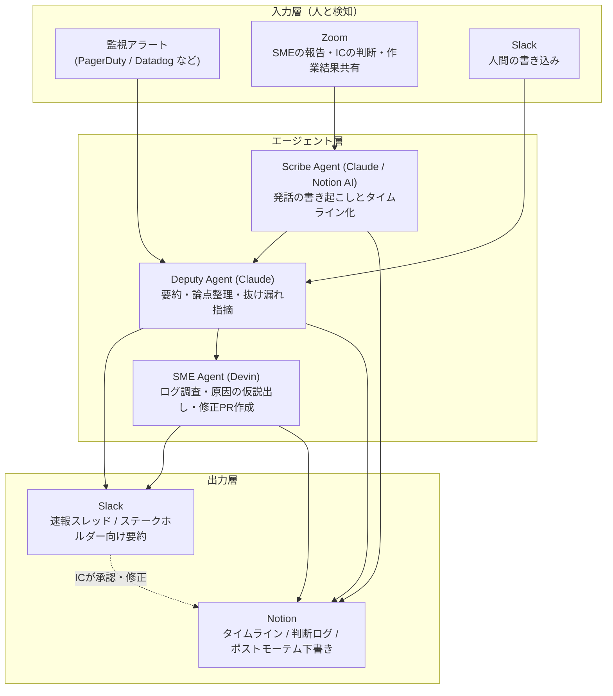

## これなに

ここ1年くらいはインシデント対応をやっていないので、忘れないうちに自分の知識や経験を棚卸ししておこうと思い付き、この記事を書こうと思いました。
ただ、せっかくならAIを活用したインシデント対応のフレームワークを考えてみようと思った感じです。

先の通りインシデント対応から若干離れているので、少し妄想が入るかもしれませんがご愛嬌ということで許してください〜

## AIが入り込む前までのレガシーなインシデント対応のフレームワーク

いろいろなフレームワークがあるとは思いますが、現場で適用して一番しっくりきたのは [PagerDuty のインシデント対応プロセス](https://response.pagerduty.co.jp/)でした。自分にとってのレガシーなフレームワークはこの PagerDuty が出しているプロセスの型なので、これを前提の後述の AI エージェントを活用したインシデントマネジメントの考えを書いています。
全部読むと結構ボリュームがあるのですが、事前、インシデントの最中、事後のアクション。それに加えてインシデント発生時の体制などがまずは重要になるので、まずはその辺りに関してレガシーなフレームワークを自分の考えで噛み砕いた内容をご紹介します。もっと詳しく知りたい方は PagerDuty のトレーニングマテリアルを参照いただくと良いかと思います。

### マインドセット

気をつけることを1から10まで言うとものすごく沢山あるのですが、個人的に特に重要だと思った**インシデント対応中におけるマインドセット**を以下にピックアップします。

- まずはサービス復旧を第一に
- エスカレーションを躊躇しない
- 気を遣わず意見はどんどん出していく
- 非難しない
- Incident Commander が責任者であり、平時の階級に関係なく、Incident Commander が会議で最も高い階級である（CEOよりも上位の決定権限を持つくらいの認識であるべき）

### インシデント対応体制

*[出典: PagerDuty Incident Response > Different Roles](https://response.pagerduty.co.jp/before/different_roles/)*

自分がもともと認識しているフレームワークの体制は上記の様な形で、ポイントをかいつまんでおくと以下の内容が個人的には重要。
あとフレームワーク上はいろいろ役割はあるものの、実際全部を与えることも難しかったりするので、チームの実情に合わせてカスタムしてOK。
なお、誰がどの役割を担うかは事前に決まっているわけではなく、その場で振り分ける。（実際の場だと実務のロールがあるので、それに引き摺られて必然的に決まりますが、最初はそれでも良い）

- **Incident Commander (IC)**
  - 重大インシデント発生時に、現在何が起きているか、およびこれから何が起こるかに関する唯一の情報源かつ意思決定者として機能する。
  - 絶対にブレてはいけない点は、**復旧作業やログ調査などは行うべきではない**ということ。
  - もしどうしても Incident Commander (IC) が調査をしなければならないということであれば、その人は IC のロールを別の人に委譲する。
- **Deputy**
  - IC を直接補佐する役割で、ステップを書き留めることに注意を払ったりタイマーをモニタリングしたりするよりも、目の前の問題に集中してもらうために IC をサポートする。
  - Deputy は IC になり得る可能性のある役割であるため、必要に応じて IC のロールを引き継ぐ可能性がある。
  - 加えて、IC になり得る可能性のあるがゆえに、 IC と同様に**復旧作業やログ調査などは行うべきではない**という点は共通。
- **Scribe**
  - インシデントの進行に応じてタイムラインを文書化し、すべての重要な決定やデータが後々のレビューのために残されるようにする。
  - IC, Deputy と同様に**復旧作業やログ調査などは行うべきではない**。
  - IC はインシデント対応のコントロールに、SME (Subject Master Expert) はインシデントの解決に注力してもらうが、現状確認や事後のポストモーテムのためにタイムラインを記録しておくことは振り返りにも活用でき、なおかつ当時気づけなかった影響範囲に気づける材料になり得るので Scribe の役割も非常に重要。
- **Liaison**
  - ステイクホルダーとのやりとり、コミュニケーションの責務を負う役割。
  - 細かいところでいうと**社内向けの Internal Liaison**, **社外向けの External Liaison** がある。
  - **Internal Liaison** の役割のイメージとしては、各プロダクトチームやカスタマーサポートチームなどのチームの窓口になる様な人たち。「Aが発生していたので、おそらくKプロダクトでBの影響が出ているかもしれません。調査お願いできますか？」みたいなやりとりをする人です。
  - **External Liaison** の役割のイメージとしては、カスタマーサポートからインシデント発生に関連した問い合わせのとりまとめや顧客対応、営業チームの顧客対応、SNSでのお知らせや Internal Liaison から受けたインシデント情報を外部に公開するような役割の人です。
  - 当然の如く、調査要員ではないため**復旧作業やログ調査などは行うべきではない**という点は共通。
- **Subject Master Expert**
  - 対象分野の専門家（以降SME）はときに解決者（Resolver）とも呼ばれ、ドメインエキスパートやサービスのオーナーなどが担う。
  - 問題の診断、調査、修正など実際に手を動かす。
  - 基本的に独断はしない、必ず決定権者である IC に意見を訊く。（もちろん提案はOK、独断で行動しないというだけ）

### 事前のアクション

PagerDuty のトレーニングマテリアルのすべてを抜粋、ではなく自分が実務の中で必要と感じたものを抜粋あるいはカスタムしたものを下記に列記します。

- **[ポストモーテム](https://response.pagerduty.co.jp/after/post_mortem_template/)のテンプレート作成**
  - 事象内容、対応記録などの報告書ドキュメント。
  - 先ほどの Scribe の人が対応記録をまとめたりする対応記録とは別で、清書するためのもののような位置付け。
- **インシデント対応ドキュメント作成**
  - 事象発生時に汎用的に使用するドキュメント。
  - Scribe がタイムラインを記録したり、 SME が調査内容や対応した作業ログを残したりするために使用する。
- **重要度の定義**
  - セキュリティ事故やデータ不整合といったユーザーが使えないだけではなくビジネスに甚大な影響があるレベルなのか、サービスが完全ダウンするレベルなのか、一部サービスは継続して利用できるレベルなのかなどを定義する。
  - 各重要度ごとに応じて巻き込むステイクホルダーや対応方針などを決めておく。（セキュリティ事故やデータ欠損などであればナントカ省に報告するとか、一部サービスダウンならプロダクトのインシデント情報ページに掲載するだけにするとか）
- **事前トレーニング（避難訓練）**
  - 実際にインシデントが発生すると結構慌てふためくので、実際にステージングや開発環境で擬似的にインシデントを発生させて練習してみるのが良いです。実際に自分が受け持ったチームも最初は誰もICができなかったりSMEができなかったりしたのですが、実際にトレーニングすると属人化が排除されました。
  - 実務で使ったものを紹介すると、自分のプロダクトは k8s に乗っていたので [Chaos Mesh](https://chaos-mesh.org/) を使ってポッドを落としてみたり通信遮断したりして擬似インシデントを起こしてトレーニングを定期的に行っていました。

### インシデント発生時のアクション

ここはテンプレートがあるというわけでもないですが、基本はインシデントの解決に向かってアクションを起こすという話が基本筋です。
ただ、個人的にチームとコミットしていたのは以下の様なことでした。

- **すぐに単独行動を起こさず、まずは役割分担を行う。**
  - 単独行動で解決するケースもありますが、それは成功した経験があったから。
  - 失敗したり、誤った方向に突っ走ってしまうこともあるので、突っ走ることはしないようにしましょう。
- **短期的なゴールと長期的なゴールを決める。**
  - 短期的なゴール：一次解決、ユーザーが基本機能を利用できることを目標とするといったゴールなど。
  - 長期的なゴール：恒久的な解決、問題の根本原因の調査や対応方針の決定など。
  - ただ、まずはサービス復旧を優先した方が良いので、長期的なゴールの詳細についてはその場で議論をするよりも大枠だけ決めておけばOK。
- **役割分担が終わったら方針、アクションを決めて解決に向けて行動を開始する。**
  - ここで大事なことは、マイルストーンを決めつつ、アップデートしていくこと。ここは IC がしっかり判断していく。
  - チームは IC に付き従うだけではなく、必要があれば意見を出していき、チームで解決に向けて進みましょう。

### 事後のアクション

みなさんご存知の通り、事後は**ポストモーテム**の実施ですね。[PagerDuty のポストモーテムに関するページ](https://postmortems.pagerduty.co.jp/)が詳しいので、詳細はそちらを参照いただいた方が良いです。
ただ、かいつまんでポイントだけをピックアップすると以下のアクションを取ると良いかと思います。

- インシデントの内容を振り返りましょう。いつ、何が、なぜ発生したのかを明らかにしていきます。
- 前項の「長期的なゴール」の詳細を詰めます。
  - 恒久的な解決をどの様に行うのかを考えます。
  - 結果的に恒久的な解決にならなくても気にしないでください。コストベネフィットと天秤にかけて決めましょう。
- 何をするか決めたら恒久対策にむけてアクションをとっていきましょう。

## AIが入り込んだインシデント対応のフレームワークの構想

ここまでは自分のインシデント対応の振り返りを含めたこれまでのインシデント対応のポイントでした。
ここまでで十分長い話だったのですが、ここからは妄想を含めたこれからのインシデント対応に関しての自分の考えです。

### 体制案

基本はこれまでの体制と大きく変わることはないと思っています。
ただ、各役割でAIエージェントは活用できると思います。正直みなさんの想像の範疇を全く超えていないとは思うのですが、適用できそうなところは以下のところです。

- Deputy Agent: IC の支援、判断や情報の整理などを行う
- Scribe Agent: チャット、オンラインミーティング内での議事録、対応のタイムラインを記録する
- SME Agent: プロダクトごと、サービスごとの調査や修正を行う

### インシデント対応アーキテクチャ

体制の話だけだと絵に描いた餅なので、実際にどうツールを組み合わせるのかを考えてみます。
ここでは自分が実務で使ったことのある、あるいは今使っているツールを前提に組んでみます。

- **Slack**: インシデントの主戦場。チャンネル（War Room）ベースでの情報集約と速報の場。
- **Zoom**: SME や IC が実際に声で会話する場。文字だけだと絶対に追いつかない場面があるので、音声は残す前提。
- **Notion**: タイムライン、判断ログ、ポストモーテムの一次ソース。
- **Claude**: 情報の要約・整理・記録のオーケストレーション役。Deputy Agent / Scribe Agent の中身。
- **Devin**: コードベースに手を入れる調査・修正の実行役。SME Agent の中身。

#### 全体像

ポイントは、**人間（IC / SME）は Zoom と Slack だけを見ていれば良い状態にする**ことです。
Notion への記録はエージェント側の仕事にして、人間には「復旧」と「意思決定」だけに集中してもらう、という思想です。

#### 1. Zoom での会話を起点にした Slack への速報

インシデント中によく起きる問題のひとつは、**Zoom に入っている人と入っていない人の情報格差**です。
Zoom で SME が「Redis のコネクションプール枯渇ですね」と言った瞬間、その情報は Zoom に入っている数人にしか届いていません。一方で Slack には「状況どうですか？」というステークホルダーからの問い合わせが溜まっていきます。
そして IC か Deputy が Slack に書き込みに行く、という時間のロスが発生することも多いかと思います。

ここを Scribe Agent と Deputy Agent で埋めます。

- **Zoom の文字起こし（ライブトランスクリプト）を継続的に取り込む**
  - Zoom の Transcript を逐次取り出して、Scribe Agent（Claude）に流し込みます。
- **一定の粒度でチャンクに区切って要約させる**
  - 全文をそのまま Slack に流しても誰も読まないので、「1〜2分ごと」あるいは「話題が切り替わったタイミング」で区切って要約させる。
- **「速報に値するか」を判定させる**
  - ここが重要で、全部の要約を Slack に投げるとノイズになってインシデント対応の邪魔になります。以下のようなものだけを速報の対象にします。
    - 影響範囲に関する新しい事実（「決済APIも落ちてます」）
    - 原因に関する仮説の確定・棄却
    - IC の意思決定（「一旦ロールバックします」）
    - 短期ゴールの達成（「一次復旧しました」）
  - 逆に、雑談・確認中の途中経過・「ちょっと待ってください」系の発話は捨てます。
- **Slack のインシデントチャンネルにスレッドで速報を落とす**
  - `🔴 速報 / 14:32` のようなプレフィックスをつけて、人間の書き込みと視覚的に区別できるようにしておくと混乱が減ることを期待しています。
  - 誰の発話由来なのか（SME の報告なのか IC の判断なのか）をラベルとして添えます。これがないと「AIが言ってるだけ」なのか「ICが決めたこと」なのかが区別できず、二次災害のもとになるためです。

これで、Zoom に入っていない Internal Liaison や External Liaison が、Slack を見ているだけでリアルタイムに状況を追える状態になります。
実装としては、Claude の Slack 連携（Claude in Slack）を使ってチャンネルに常駐させるか、Agent SDK でワーカーを書いて Slack Bot として動かすかのどちらかになると思います。

#### 2. Notion への記録（タイムラインと判断ログ）

前半で「Scribe の役割は非常に重要」と書きましたが、正直なところ**Scribe は人間がやると一番しんどい役割**です。
喋る速度に手が追いつかないし、記録に集中すると議論が追えなくなる。かといって記録がないとポストモーテムの質が一気に落ちます。ここは素直に AI に任せたいところです。

- **タイムラインの自動生成**
  - Zoom の書き起こし（Notion AI や Zoom の要約機能で取得）と Slack の発言を突き合わせて、時刻付きのタイムラインを Notion のインシデントページに追記していきます。
  - 事前アクションで作った「インシデント対応ドキュメント」のテンプレートを Notion のデータベーステンプレートにしておいて、インシデント発生時にエージェントがページを新規作成するところまで自動化できると理想です。
- **判断ログを独立して残す**
  - タイムラインとは別に、**「IC が何を、なぜ、いつ決めたか」だけを抜き出したテーブル**を持っておくと、ポストモーテムの質が劇的に上がります。
  - `時刻 / 決定内容 / 根拠となった情報 / 決定者 / 結果` くらいのカラムがあれば十分です。
  - 「なぜその判断をしたか」は後から絶対に思い出せないので、その場の発話から根拠を拾ってくれるだけでも価値があります。
- **SME の報告を構造化して残す**
  - 「誰が」「どのコンポーネントを」「どう調べて」「何がわかったか」を Zoom の発話から抽出して記録します。
  - これが残っていると、次に同じ症状が出たときの調査の初速がまったく変わります。
- **短期ゴール / 長期ゴールとアクションアイテムの起票**
  - Zoom で「これは恒久対応で見ましょう」と流れていった話は、だいたい忘れられます。
  - 会話の中から長期ゴール候補を拾って Notion のタスクとして下書きしておき、ポストモーテムの場で取捨選択する、という流れにすると取りこぼしが減ります。

#### 3. SME Agent（Devin）による調査と修正

人間の SME が手を動かしている裏で、Devin にも並行で調査させます。

- **調査の並列化**
  - IC が「Redis 説」と「デプロイ起因説」の2つの仮説を持っているとき、人間の SME に片方、Devin にもう片方を割り当てるといった使い方ができます。
  - 人間の手が足りないインシデントで効いてきます。
- **直近のデプロイ差分の洗い出し**
  - 「直近3時間にマージされた PR のうち、決済系に触っているものを列挙して」のような依頼はかなり相性が良いかと期待しています。
- **修正 PR の作成までを任せる**
  - ただし、**マージと本番反映は必ず人間（IC の承認）を挟む**。みなさんお詳しいかとは思いますが、インシデント対応で AI に PR を作成させると破壊的な問題を起こしかねないのでレビューはしないといけないなと思います。
- **調査結果も Slack と Notion に流す**
  - Devin の作業結果を Deputy Agent 経由で要約して Slack に速報として流し、同時に Notion のタイムラインにも記録します。

#### 4. Deputy Agent による IC の支援

Deputy Agent は、Slack と Notion に溜まった情報を横断的に見て IC を支援します。人間の Deputy を置き換えるというより、人間の Deputy の下働きをするイメージです。

- **IC からの「今どうなってる？」に即答する**
  - Slack でメンションすると、現時点の状況・確定した事実・未確定の仮説・進行中のアクションを整理して返します。
- **抜け漏れの指摘**
  - 「短期ゴールが設定されてから30分経過していますが、進捗の共有がありません」
  - 「影響範囲について、B プロダクトへの波及が未確認のままです」
  - こういう**タイマーとチェックリストの役割**は、実は AI が一番得意なところです。人間の Deputy がやっていた「タイマーのモニタリング」はまるごと任せられます。
- **ステークホルダー向けの文面のドラフト**
  - Liaison 向けに、社内向け・社外向けそれぞれのトーンで状況説明の下書きを作ります。
  - 当然ながら、**外部に出す文章は必ず人間がレビューする**。ここも譲れないポイントです。

#### このアーキテクチャで気をつけるべきこと

ここまで威勢よく書きましたが、AI を入れることで新しく生まれるリスクもあるので、そこも書いておきます。

- **AI の出力と人間の決定を必ず区別する**
  - 一番怖いのは、AI が出した仮説がいつのまにか「確定した事実」としてタイムラインに乗り、それを前提に意思決定が進んでしまうことです。
  - Slack でも Notion でも、**発信元（人間 / エージェント）と確度（確定 / 仮説）を必ずラベリングする**運用にしておくべきだと思います。
- **速報の頻度は絞る**
  - AI は無限に喋れてしまうので、放っておくとインシデントチャンネルが AI の独り言で埋まります。人間の会話を邪魔した瞬間に、このアーキテクチャは害になります。
- **意思決定は IC から動かさない**
  - 前半で「IC が唯一の意思決定者」と書きましたが、これは AI が入っても変わりません。むしろ AI が提案してくることが増える分、**AI の提案を採用するかどうかを IC が明示的に決める**というプロセスが重要になると思っています。
- **落ちるときは一緒に落ちる**
  - Slack や Zoom、あるいは AI サービス自体が落ちているケースのインシデントもあり得ます。**AI なしで回す手順を捨てない**ことは大前提です。事前トレーニング（避難訓練）も、AI ありパターンと AI なしパターンの両方をやっておくのが良いと思います。
- **記録に何を残すかは事前に決めておく**
  - インシデントの内容によっては、個人情報や認証情報が会話に出てくることがあります。書き起こしをそのまま外部サービスに投げる構成にする場合は、このあたりの整理は事前に済ませておく必要があります。

結局のところ AI にやらせているのは、**「記録」「要約」「伝達」「監視」といった、人間がやると疲弊するが手を抜くと後で効いてくる仕事**です。
逆に「決める」「責任を持つ」という部分は人間に残る。前半に書いたレガシーなフレームワークの思想は、AI が入っても本質的には何も変わらないというのが、今のところの自分の考えです。
